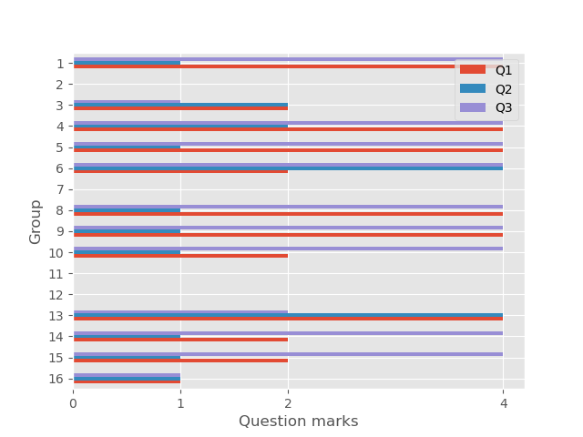

# **TBL Data extractor & report generator**

The Team Based Learning (TBL) data extractor downloads and analyses the results of three questions that students answer during the first 10 minutes in the lecture. 

## **Before the lecture**

Students have to go through pre-study material in preparation for the lecture. 
It consists of pre-recorded bite-sized video lecture sections that cover the week's course content. 
Questions follow each video exerpt to test your understanding of the theory discussed in the video content.
Students can attempt the questions as many times as they like to ensure they are comfortable with the theory in preparation of the lecture.
Once they are satisfied they understand the pre-study material, they complete the individual readiness assurance test (iRAT) which needs to be completed before attending the lectorial.

The iRAT questions are multiple choice questions.

## **During the lecture**

During the first 10 minutes of the lecture, the students complete the Team Readiness Assurance Test (tRAT) in groups. 

The tRAT is exactly the same as the iRAT. 

The idea is that students discuss the questions as a group and why they chose a certain answer.
They then decide as a group what answer to submit.

If the answer is correct, they move on to the next question.
If the answer is incorrect, they need to re-try the question they got wrong. 
They repeat this until they get the question right.

All groups will be graded on how many times they had to re-do the question before they got the correct answer.

* Correct 1st attempt - **4 marks**
* Correct 2nd attempt - **2 marks**
* Correct 3rd attempt - **1 mark**
* No attempt - **0 marks**

> In order to get the most marks, group members need to contribute to the discussion by ensuring that they have gone through the pre-study material. This will increase their chance to get full marks.

## **Extracting the data**

It is not feasible to manually download the csv files with the answers and calculate the group marks during the lecture. 
It will take a lot of time and waste valuable teaching time.
I created a script that uses Selenium to download the csv files and then using Pandas, analyse the answers and allocate the marks to the group. 

Here is a GIF showing the extraction process:

The whole extraction and analysis takes approximately **45 seconds**

The result is a graph as below:

The graph makes it possible to quickly see what questions the majority of the groups struggled with and additional time can be allocated in the lecture to address the topic. 

From the graph it is clear that groups struggled the most with **Question 2**.

## **After the lecture**

Student engagement with the pre-study material as well as the iRAT is extracted from two csv files. 
A table is created showing the percentage engagement of each week. 
The table forms part of a LaTeX template that generates a report for monitoring student engagement during the pandemic.

An example of the report can be found [here](https://github.com/adriaan-portfolio/tbl-data-extractor/blob/main/engagement-report.pdf).

Student engagement was poor during the teaching semester and feedback surveys indicate that a reason for this is the lack of face-to-face teaching, especially as it is a coding module with an engineering kinematic focus.

## **Future work**
A lot of separate csv files are downloaded and loaded into dataframes using pandas and merged with other dataframes. 
A more efficient approach would be to load the data into a database and use SQL to query data of individual students and/or groups.
